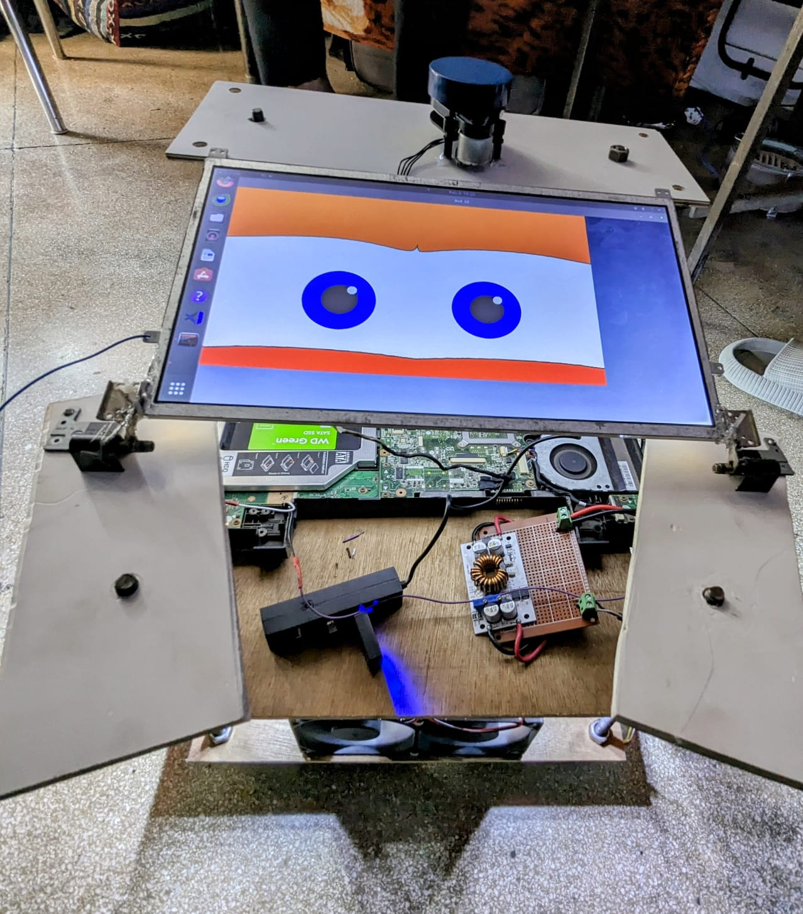
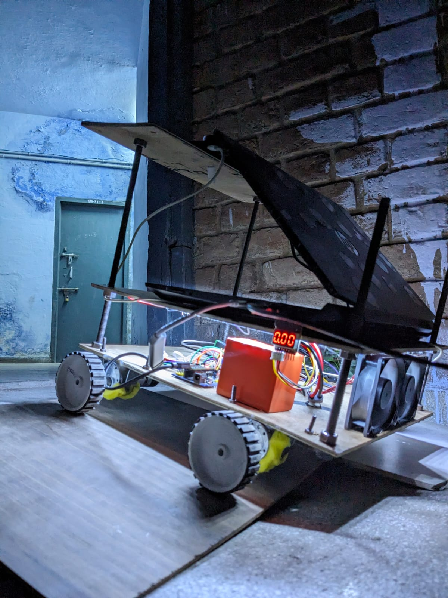

# Autonomous E-Bot Project using ROS 2 Foxy

This repository contains the code and resources for an autonomous car project using ROS 2 Foxy. The project includes integration with an ASUS motherboard for processing, x2 YLidar for sensing, wheel encoders (OE-28 Hall Effect Two Channel Magnetic Encoder), and Orange 12V 300 RPM Johnson Geared DC Motors for propulsion.

## Hardware Components

- ASUS motherboard for processing
- x2 YLidar for environmental sensing
- OE-28 Hall Effect Two Channel Magnetic Encoder for wheel encoders
- Orange 12V 300 RPM Johnson Geared DC Motors
- Orange 3S 5000mAh battery for electronics
- 4400mAh battery for the laptop
- Arduino Nano with L298N motor driver shield for motor control
- Buck and boost converters for power management
- Battery voltage tester for monitoring

## Setup Instructions

1. Clone this repository into your ROS 2 workspace.
2. Install all dependencies using `rosdep`.
3. Build the packages using `colcon build`.
4. Launch the simulation using the provided launch files.
5. Make sure to configure ROS 2 control for motor control.

## Notes

- Use the provided launch files under the `articibot_one` package for navigation and control.
- If using x2 YLidar, consider using the RViz configuration provided with the lidar package for visualization.
- Utilize 2 L298n motor drivers shorted out .
- Monitor battery levels using the battery voltage tester for optimal performance.

## Product Links

- [Motors](https://robu.in/product/grade-a-quality-orange-12v-300-rpm-johnson-geared-dc-motor/)
- [Encoders](https://robu.in/product/oe-28-hall-effect-two-channel-magnetic-encoder/)
- [Battery](https://robu.in/product/18650-li-ion-4000mah-11-1v-3s3p-protected-battery-pack/)
- [Buck and Boost Converters](https://robu.in/product/250w-high-power-constant-voltage-current-adjustable-aluminum-substrate-led-driver-module/)
- [Motor Driver](https://robu.in/product/l298n-2a-based-motor-driver-module-good-quality/)
- [Arduino Nano](https://robu.in/product/atmega328p-5v-nano-v3-0-development-board-16mhz-ch340-type-c/)
- [Nano 328P Expansion Adapter](https://robu.in/product/nano-328p-expansion-adapter-breakout-board-io-shield/)
- 

