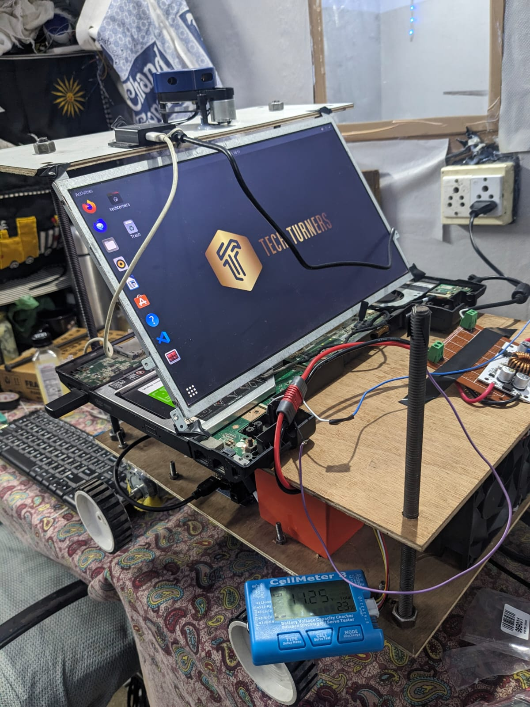

# Autonomous Bot Project using ROS 2 Foxy

Welcome to the Autonomous Bot project repository! This project aims to create an autonomous bot using ROS 2 Foxy framework for navigation and control. The bot is equipped with various sensors and hardware components to perceive its environment and make intelligent decisions for navigation.

## Hardware Components

The autonomous bot is built using the following hardware components:

- **ASUS Motherboard**: Provides processing power and computing capabilities.
- **YLidar x2**: Environmental sensing LiDAR sensors for mapping and obstacle detection.
- **OE-28 Hall Effect Two Channel Magnetic Encoder**: Wheel encoders for measuring wheel rotations and odometry.
- **Orange 12V 300 RPM Johnson Geared DC Motors**: Motors for propulsion and movement.
- **Orange 3S 5000mAh Battery**: Power source for electronics.
- **4400mAh Laptop Battery**: Power source for the laptop.
- **Arduino Nano with L298N Motor Driver Shield**: Motor control unit for driving the DC motors.
- **Buck and Boost Converters**: Power management modules for efficient voltage regulation.
- **Battery Voltage Tester**: Monitoring device for tracking battery levels.

## Setup Instructions

To set up the autonomous bot project on your system, follow these steps:

1. **Clone the Repository**: Clone this repository into your ROS 2 workspace:

2. **Install Dependencies**: Install all required dependencies using `rosdep`:

3. **Build Packages**: Build the ROS 2 packages using `colcon`:

4. **Launch Simulation**: Launch the simulation using provided launch files and configurations.

5. **Configure Motor Control**: Make sure to configure ROS 2 control for motor control, ensuring proper communication with the Arduino Nano and L298N motor driver shield.

## Notes

Here are some important notes to consider when working with the autonomous bot:

- Use the provided launch files under the `articibot_one` package for navigation and control.
- If using YLidar sensors, utilize the RViz configuration provided with the lidar package for visualization.
- Ensure that both L298N motor drivers are properly configured and shorted out for optimal motor control.
- Regularly monitor battery levels using the battery voltage tester to prevent unexpected shutdowns during operation.

## Product Links

Find links to purchase the hardware components used in this project:

- [Motors](https://robu.in/product/grade-a-quality-orange-12v-300-rpm-johnson-geared-dc-motor/)
- [Encoders](https://robu.in/product/oe-28-hall-effect-two-channel-magnetic-encoder/)
- [Battery](https://robu.in/product/18650-li-ion-4000mah-11-1v-3s3p-protected-battery-pack/)
- [Buck and Boost Converters](https://robu.in/product/250w-high-power-constant-voltage-current-adjustable-aluminum-substrate-led-driver-module/)
- [Motor Driver](https://robu.in/product/l298n-2a-based-motor-driver-module-good-quality/)
- [Arduino Nano](https://robu.in/product/atmega328p-5v-nano-v3-0-development-board-16mhz-ch340-type-c/)
- [Nano 328P Expansion Adapter](https://robu.in/product/nano-328p-expansion-adapter-breakout-board-io-shield/)

  
